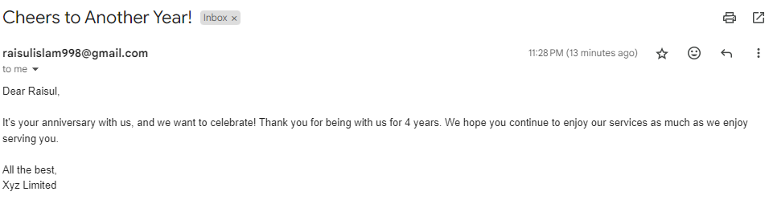
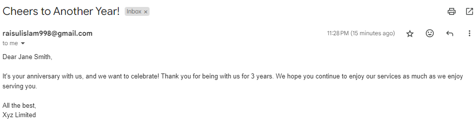

# Automated Customer Anniversary Emails

The **Automated Customer Anniversary Emails** project is a Python script designed to enhance customer engagement by automatically sending personalized anniversary emails. By recognizing customers' loyalty on their signup anniversaries, this tool allows businesses to maintain a positive relationship with their clients through thoughtful communication.

## Features

- **Automated Email Sending:** Automatically sends anniversary emails to customers based on their signup date.
- **Personalized Messages:** Each email is customized with the customer's name and the number of years they have been a customer.
- **Customizable Email Templates:** The script randomly selects from a variety of email templates to keep messages fresh and engaging.
- **Simple Configuration:** Easily set up email credentials and customize message templates for immediate use.

## Requirements

To run this project, ensure you have the following libraries installed:

- **pandas**
- **smtplib** (part of the Python standard library)
- **email** (part of the Python standard library)
- **datetime** (part of the Python standard library)

You can install pandas using pip:

```bash
pip install pandas
```

## Output Result
  
*Example of an email sent to a customer.*

  
*Example of an email sent to a customer.*

## Connect with Me
If you have any questions, suggestions, or feedback, feel free to reach out.

You can contact me via:

[](https://www.linkedin.com/in/contact-raisul)

[](https://facebook.com/raisul.anonymous)

I'm always open to discussions and collaborations.