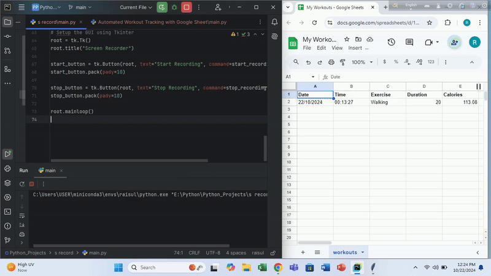

# Workout Tracking with Nutritionix API and Google Sheets Integration

## 📑 Table of Contents
- [🚀 Project Overview](#-project-overview)
- [🛠️ Features](#️features)
- [🌟 Why This Project?](#-why-this-project)
- [📋 Project Workflow](#-project-workflow)
- [🧰 Requirements](#-requirements)
- [📊 Output Result](#-output-result)


## 🚀 Project Overview
This project enables users to log their workouts effortlessly by interacting with the Nutritionix API for exercise data and storing the results in Google Sheets using Sheety. Users simply input their workout details (e.g., "I ran 5km, swam 2km, and walked 1km"), and the program fetches relevant data such as calories burned and exercise duration. The logged data is automatically stored in a Google Sheet for easy tracking and review.

### 🛠️ Features
- **Exercise Recognition:** Automatically detects various exercises (e.g., running, swimming, walking) based on user input.

- **Calorie Calculation:** Provides real-time calorie burn estimates for each activity.
- **Google Sheets Logging:** Seamlessly logs workout data in Google Sheets with a timestamp for each entry.

- **Interactive User Input:** Accepts natural language input to describe exercises, making the process intuitive.

### 🌟 Why This Project?
This project is designed to simplify workout tracking and provide an automated solution for users who want to keep a log of their physical activity without manually entering data into spreadsheets. It combines Python automation with external APIs, demonstrating real-world API integration, data handling, and authentication.

## 📋 Project Workflow
- **User Input:** Users input their exercises in plain English (e.g., "I ran 5km in 60 minutes, walked 3km").

- **Nutritionix API Call:** The program sends this input to the Nutritionix API to retrieve exercise data such as calories burned and activity duration.

- **Google Sheets Logging:** The workout data is logged in a Google Sheet using the Sheety API for easy tracking and historical review.

- **Output:** The user receives a confirmation message for each logged exercise.

### 🧰 Requirements
To run this project, you need the following:

Python 3.x
- requests library 
```bash
pip install requests
```
- A Nutritionix API key
- A Sheety account 

### 📊 Output Result:
 

### Connect with Me
If you have any questions, suggestions, or feedback, feel free to reach out.

You can contact me via:

[](https://www.linkedin.com/in/contact-raisul)

[](https://facebook.com/raisul.anonymous)

I'm always open to discussions and collaborations.