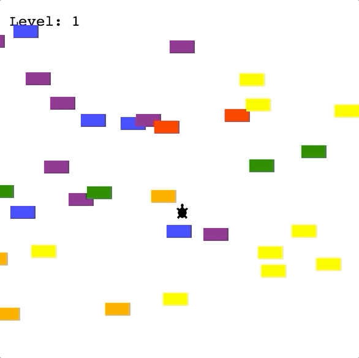

# Turtle Crossing Game

Welcome to the **Turtle Crossing Game**! This is a simple arcade-style game created using Python's Turtle module. The objective of the game is to help the turtle cross the road while avoiding incoming cars. As the player progresses, the game becomes more challenging with increased car speed.

## Game Preview
 <!-- You can replace this placeholder with an actual screenshot or gif of the game. -->

## Features
- Control a turtle and avoid the incoming cars.
- Cars are generated at random intervals.
- Every time you reach the finish line, the level increases and cars move faster.
- Visual feedback when the game is over.
- Keep track of your current level on the scoreboard.

## Connect with Me
If you have any questions, suggestions, or feedback, feel free to reach out.

You can contact me via:

I'm always open to discussions and collaborations.