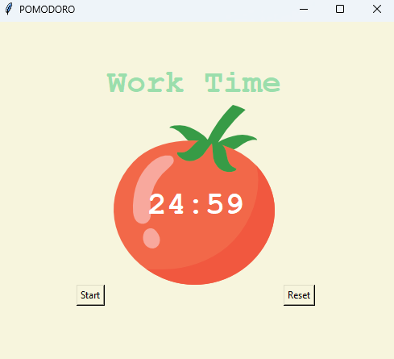
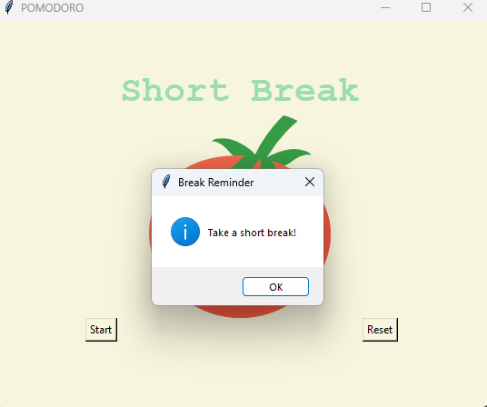

# 🍅 Pomodoro Timer

## What is the Pomodoro Technique?

The Pomodoro Technique is a time management method developed by Francesco Cirillo in the late 1980s. It encourages users to break work into intervals, traditionally 25 minutes in length, separated by short breaks. This technique helps improve focus and productivity while reducing mental fatigue.

## Features

Just start the timer, it will auto popup when it's time to take a break

## Screenshots

*Main Interface of the Pomodoro Timer*

*Break Reminder Notification*

## How to Run Locally

Just Clone/Download the Projects folder and run in Pycharm/Notebook/vs_code....
