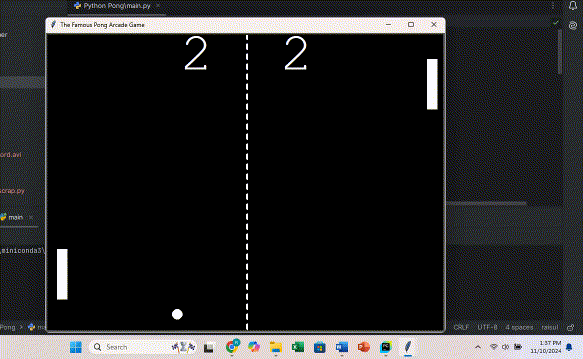

# Pong Arcade Game 🎮

Welcome to the classic **Pong Arcade Game** recreated in Python using the Turtle Graphics library! This is a simple, yet enjoyable version of the legendary two-player table tennis game, perfect for reliving some arcade nostalgia.

## Table of Contents
- [Game Preview](#game-preview)
- [Game Features](#game-features)
- [Requirements](#requirements)
- [How to Play](#how-to-play)
- [Project Structure](#project-structure)


## Game Preview 🎥


Watch the ball bounce between paddles as players battle to keep it in play and score points. 

## Game Features
- **Classic Gameplay**: Two-player Pong game with traditional arcade rules.
- **Score Tracking**: Keeps track of both players' scores.
- **Dynamic Ball Speed**: Ball speed increases after each paddle bounce for added challenge.
- **Mid-Line Design**: Center line design to mimic classic Pong visuals.

## Requirements
- **Python** 3.x
- **Turtle** Graphics library (included with Python by default)

> **Note**: Ensure you have Python 3 installed. If not, [download it here](https://www.python.org/downloads/).

## How to Play

- **Player Controls**:
  - **Right Paddle**:
    - Move Up: `↑` Arrow key
    - Move Down: `↓` Arrow key
  - **Left Paddle**:
    - Move Up: `W` key
    - Move Down: `S` key

- **Objective**:
  - Prevent the ball from going past your paddle.
  - Each time an opponent misses the ball, you score a point.
  - The first player to reach a set number of points wins (you can add a win condition if desired).

## Project Structure

The code is organized into the following files:

```markdown
├── main.py         # The main game loop and screen setup
├── ball.py         # Ball class controlling the ball's movement and collision
├── paddle.py       # Paddle class to control player paddle movement
├── score.py        # Score class to keep track and display player scores
├── draw.py         # Draw class to create the center line design
```
## Connect with Me
If you have any questions, suggestions, or feedback, feel free to reach out.

You can contact me via:

[](https://www.linkedin.com/in/contact-raisul)

[](https://facebook.com/raisul.anonymous)

I'm always open to discussions and collaborations.